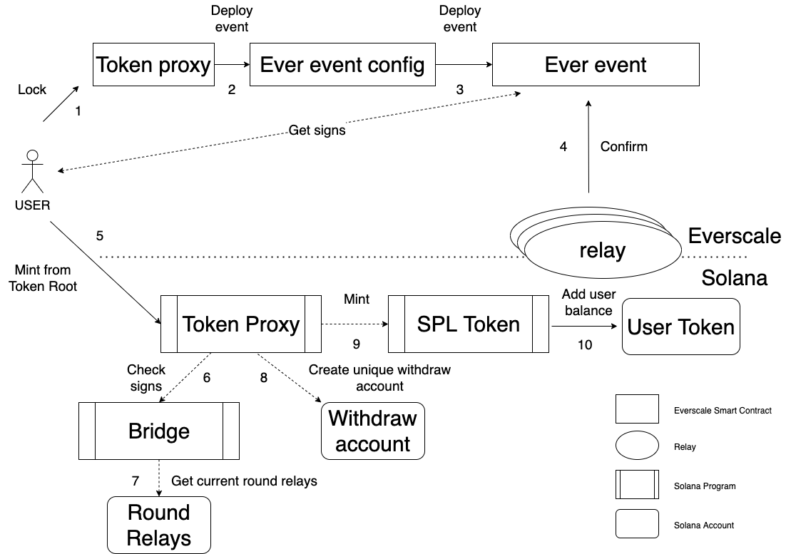

# Proposal #1

## Motivation

Bridge `Solana-Everscale` must have the ability to transfer `Everscale` tokens from `Everscale` to `Solana`. The idea here is
to use token root owned by `Token proxy` program in `Solana` blockchain to mint tokens.

## Algorithm

1. `Everscale` `Token proxy` locks user tokens after Web3 request.
2. `Token proxy` sends new event to `Ever event config`.
3. `Ever event config` deploys new `Ever event` with payload containing transfer.
4. Relays confirm `Ever event`.
5. User calls mint tokens in `Solana` `Token Proxy` program transferring payload with relays signs.
6. `Token Proxy` program calls `Round loader` program to check relays signs.
7. `Round loader` program gets current round relays info (public keys, addresses) and checks signs.
8. If no error got from `Round loader` program, then `Token proxy` creates unique withdraw account with `PayloadId` from event.
9. If no withdraw account was created before, then `Token proxy` program calls mint on `SPL token` program.
10. `SPL token` program mints tokens and increases users balance.

## Questions

1. Where to store `Token root` account address?
It will be passed on program input by user, and it must be validated in `Token proxy` program.
2. Where to store `Round loader` program address?
It will be passed on program input by user, and it must be validated in `Token proxy` program.
3. Where to store `Current round relays` account address?
It will be passed on program input by user, and it must be validated in `Round loader` program.

## Scheme

## Issues

The main issue of this scheme is the same as with the proposal for transferring `Solana` tokens from `Everscale` to `Solana`.

# Proposal #2

## Motivation

The same as with the proposal #2 for transferring `Solana` tokens from `Everscale` to `Solana`.

## Mint Algorithm

Mint algorithm

1. `Everscale` `Token proxy` burns user tokens after Web3 request.
2. `Token proxy` sends new event to `Ever event config`.
3. `Ever event config` deploys new `Ever event` with payload containing transfer.
4. Relays get info from `Ever event`, containing all withdrawal payload.
5. User calls withdraw tokens from token root in `Solana` `Token Proxy` program, transferring payload.
6. `Token proxy` creates unique withdraw account with payload from event.
7. Relays get callback from `Token proxy` program about new withdrawal.
8. Relays send confirm withdrawal to `Token proxy`, containing payload from `Everscale`.
9. `Token Proxy` gets requested round relays info (public keys, addresses), checks that callers address is relay and round is not expired.
10. If all is ok, `Token Proxy` program saves relays approval to withdrawal account and checks if there are enough confirms. 
11. if there are enough confirms, `Token proxy` program calls mint tokens on `SPL token` program.
12. `SPL token` program mints tokens and increases users balance.

In this case withdrawal account can have only three states: new, processed and waiting for approve.

## Scheme

