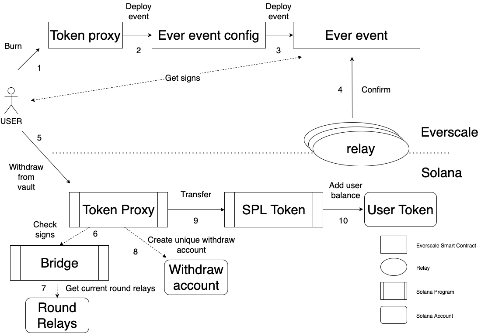

# Proposal #1

## Motivation

Bridge `Solana-Everscale` must have the ability to transfer `Solana` tokens from `Everscale` to `Solana`. The idea here is
to use vault owned by `Token proxy` program in `Solana` blockchain to unlock tokens.

## Algorithm

1. `Everscale` `Token proxy` burns user tokens after Web3 request.
2. `Token proxy` sends new event to `Ever event config`.
3. `Ever event config` deploys new `Ever event` with payload containing transfer.
4. Relays confirm `Ever event`.
5. User calls withdraw tokens from vault in `Solana` `Token Proxy` program transferring payload with relays signs.
6. `Token Proxy` program calls `Bridge` program to check relays signs.
7. `Bridge` program gets current round relays info (public keys, addresses) and checks signs.
8. If no error got from `Bridge` program, then `Token proxy` creates unique withdraw account with `PayloadId` from event.
9. If no withdraw account was created before, then `Token proxy` program calls transfer tokens on `SPL token` program.
10. `SPL token` program decreases `Vault` account tokens and increases users tokens balance.

## Questions

1. Where to store `Vault` account address?
It will be passed on program input by user, and it must be validated in `Token proxy` program.
2. Where to store `Bridge` program address?
It will be passed on program input by user, and it must be validated in `Token proxy` program.
3. Where to store `Current round relays` account address?
It will be passed on program input by user, and it must be validated in `Bridge` program.

## Reminders

1. Set owner of `Vault` account to `Token proxy` program.

## Scheme

## Issues

The main issue of this scheme is that user must pass all relays signs in transaction of creating withdrawal in `Solana`.
They do not fit the max size of client transaction, and user have to us batching, signing every part with his keys.

# Proposal #2

## Motivation

As it has been described in `Relay round loading` proposal #2 we do not need to check signatures in programs, because 
we always know who is calling its in `Solana`. So this is the first modification. Another one is that we can avoid loading
all relays approvals from user side, because they can themselves confirm withdrawal in `Solana`.

## Withdrawal Algorithm

Standard withdrawal algorithm

1. `Everscale` `Token proxy` burns user tokens after Web3 request.
2. `Token proxy` sends new event to `Ever event config`.
3. `Ever event config` deploys new `Ever event` with payload containing transfer.
4. Relays get info from `Ever event`, containing all withdrawal payload.
5. User calls withdraw tokens from vault in `Solana` `Token Proxy` program, transferring payload.
6. `Token proxy` creates unique withdraw account with payload from event.
7. Relays get callback from `Token proxy` program about new withdrawal.
8. Relays send confirm withdrawal to `Token proxy`, containing payload from `Everscale`.
9. `Token Proxy` gets requested round relays info (public keys, addresses), checks that callers address is relay and round is not expired.
10. If all is ok, `Token Proxy` program saves relays approval to withdrawal account and checks if there are enough confirms.
11. `Token proxy` checks vault balance. 
12. If balance is enough, `Token proxy` program calls transfer tokens on `SPL token` program.
13. `SPL token` program decreases `Vault` account tokens and increases users tokens balance.

### Withdraw account

Withdraw account is containing following:
* Round number
* Receiver address in `Solana`
* Sender address in `Everscale`
* Amount
* Payload Id
* Bounty for withdrawal
* State: new, expired, processed, cancelled, pending
    * `New` is needed to save relays confirms.
    * `Expired` - current round ttl is expired and withdrawal can not be processed.
    * `Processed` - all funds were successfully transferred to user.
    * `Cancelled` - user asked to cancel withdrawal, his funds were minted in `Everscale` to his address back.
    * `Pending` - there is not enough funds on vault to process the withdrawal.

## Scheme

## Force pending withdrawal algorithm

User can force his withdrawal in pending state when he sees that vault balance is enough.

1. User calls force pending withdraw in `Solana` `Token Proxy` program, transferring payload.
2. `Token proxy` checks existence of withdraw account, relays confirmations, pending state.
3. `Token proxy` checks vault balance.
4. If balance is enough, `Token proxy` program calls transfer tokens on `SPL token` program.
5. `SPL token` program decreases `Vault` account tokens and increases users tokens balance.

## Cancel pending withdrawal algorithm

User can cancel his withdrawal in pending state when he wants to decline it.

1. User calls cancel pending withdraw in `Solana` `Token Proxy` program, transferring payload.
2. `Token proxy` checks existence of withdraw account, relays confirmations, pending state.
3. `Token proxy` sets withdrawal state as cancelled.
4. `Token proxy` creates `Deposit` PDA, containing mirrored data from withdrawal account, as like the user transferred 
funds in opposite direction.
5. Relays are monitoring this transaction and begin transferring procedure from `Solana` to `Everscale` (this is described in corresponding chapter).

## Add / change bounty for pending withdrawal algorithm

User can set bounty for proceeding his pending withdrawal, in order to other users have motivation to fill it and receive
bounty in `Everscale`.

1. User calls add or change bounty for pending withdraw in `Solana` `Token Proxy` program, transferring payload and bounty size.
2. `Token proxy` checks existence of withdraw account, relays confirmations, pending state.
3. `Token proxy` checks that bounty size is lower than amount in withdrawal.
4. `Token proxy` changes bounty size in withdrawal account.

## Filling pending withdrawal algorithm

User from `Solana` side of the bridge can see that for filling withdrawal from `Everscale` side he can receive bounty
in `Everscale`. So he creates corresponding transfer of tokens from `Solana` to `Everscale`.

1. User calls fill pending withdraw in `Solana` `Token Proxy` program, transferring payload.
2. `Token proxy` checks existence of withdraw account, relays confirmations, pending state.
3. `Token proxy` checks that users balance is bigger than amount in withdrawal minus bounty.
4. `Token proxy` program calls transfer tokens (withdrawal amount minus bounty) on `SPL token` program.
5. `SPL token` program decreases users account tokens and increases withdrawal receiver tokens balance.
6. `Token proxy` creates `Deposit` PDA, containing mirrored data from withdrawal account, as like the user transferred
   all funds in opposite direction.
7. Relays are monitoring this transaction and begin transferring procedure from `Solana` to `Everscale` (this is described in corresponding chapter).

