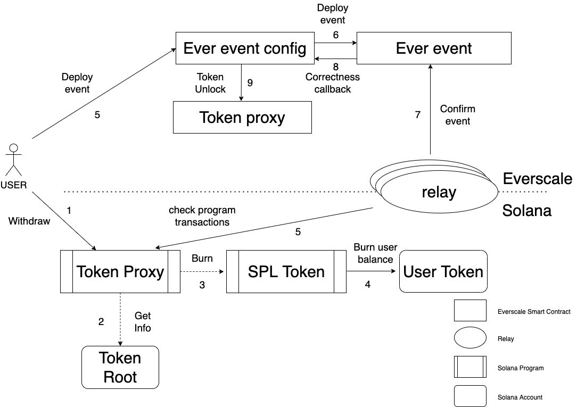

# Proposal #1

## Motivation

Bridge `Solana-Everscale` must have the ability to transfer `Everscale` tokens from `Solana` to `Everscale`. The idea here is 
to use token root owned by `Token proxy` program in `Solana` blockchain to burn tokens.

## Algorithm

1. `Solana` `Token proxy` program receives withdraw request from user via Web3.
2. It gets info from `Token root` account.
3. It uses `SPL token` program to burn tokens received from user.
4. `SPL token` program decreases users balance and burns tokens.
5. Relays monitor `Solana` `Token proxy` program transactions to receive notification about new transfers via `Solana` Node RPC.
6. User deploys event of new transfer to `Everscale event configuration` via Web3.
7. `Everscale event configuration` deploys new `Everscale event` with payload containing transfer.
8. Relays confirm `Everscale event`.
9. `Everscale event` sends correctness callback to `Everscale event configuration`.
10. `Everscale event configuration` unlocks `Everscale` tokens via `Token proxy` and sends them to users address in `Everscale` blockchain.

## Questions

1. Where to store `Token root` account address?
It will be passed on program input by user, and it must be validated in `Token proxy` program.

## Scheme

## Proposal #2

To save all token burns by user it is good to use the same PDA as for `Solana` tokens from `Solana` to `Everscale` transfer, 
created on each user request.
Between steps 4 and 5 `Token proxy` program should create such one.

### Deposit model

Deposit model is the same as for `Solana` tokens from `Solana` to `Everscale` transfer.

It will not have any status because we assume that it is created when user funds was successfully burned.