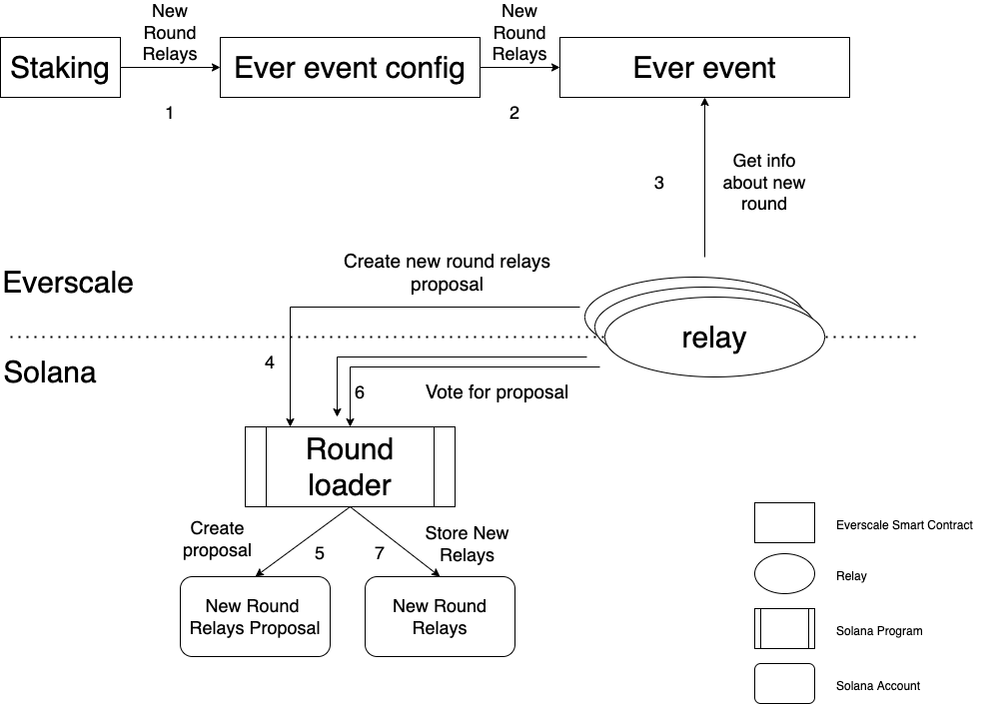

# Proposal #1 (DEPRECATED)

## Motivation

In order to check the signatures of relays for each transfer from `Everscale` to `Solana`, all round relays must be stored in `Round loader` [PDA](https://pencilflip.medium.com/learning-solana-3-what-is-a-program-derived-address-732b06def7c1) account. 

This will cost a very little of money, paid for the [rent](https://docs.solana.com/developing/programming-model/accounts#rent). 
For each round new non-upgradeable PDA account will be created.

## Algorithm

1. `Everscale` `Staking` sends new round relays to `Everscale event configuration`.
2. `Everscale event configuration` deploys new `Everscale event` with payload containing new round relays.
3. Relays confirm this event.
4. Relays transfer this event to `Solana` `Round loader` program.
5. `Round loader` program gets old round relays info (public keys, addresses) from PDA and checks correctness of signatures received in event info.
6. `Round loader` stores in PDA new round relays info.

## Scheme

## Questions

1. Where to store current round account address?
It will be calculated from relays round and formed by `Round loader` program, using seeds mechanics.
2. Who can transfer new round relays to `Solana`?
If it is relays, they must have lamports to pay gas fee. 
If it is some kind of admin, it must have access to do it. Maybe he mustn't as this event is signed by old round relays and this check is enough.
3. What is the size of new relays? Can it be placed in one transaction?
The size of one relay pub key is 32 byte. The maximum count of relays in one round is 100. To use all relays loading in one transaction
its size must be at least 3200 byte. The limit is 1232 bytes. So this proposal design, copied from `Ethereum` bridge, is not appropriate in `Solana`! 

# Proposal #2 (Current)

## Motivation

In `Solana` by design we can calculate who is calling the instruction inside program, so we do not need any signatures like in `Ethereum`, where we do not know that and can 
check it only by signatures. Knowing this, we can simplify our bridge architecture, authorizing calls of new `Relays` loading by current round relays. 
In that way we also are limited in transaction size and the need to pay for these calls.
The price for one such transfer can cost about 0.01$ by current gas price. Assuming, that relays can take this load.
To avoid client transaction limit we can divide loading into parts.
Here is some point to attack. If one or more relays are compromised, they can load false relays keys in new round.
We can avoid that by creating new relays proposal, that only current round relay can create. And if that proposal 
achieve 2 / 3 + 1 vote by current round relays, this proposal become new round relays. 
The proposal can be created in manual / semi-manual mode by relays. It is PDA of `Round loader` program with address derived
from seed containing round number, proposal author public key and `Round loader` program id.

## Algorithm

1. `Everscale` `Staking` sends new round relays to `Everscale event configuration`.
2. `Everscale event configuration` deploys new `Everscale event` with payload containing new round relays.
3. Relays confirm this event.
4. Special script creates new round relays proposal via `Solana` `Round loader` program.
5. `Round loader` program creates PDA, containing proposal data.
6. Relays are voting for it using `Round loader` program and proposal address.
7. If voting is completed, `Round loader` stores in PDA new round relays info.

### New round relays proposal account

New round relays proposal description can be found in ([Round loader](../programs/round_loader.md)) in accounts section
  
### New round relays account

New round relays description can be found in ([Round loader](../programs/round_loader.md)) in accounts section

## Scheme

