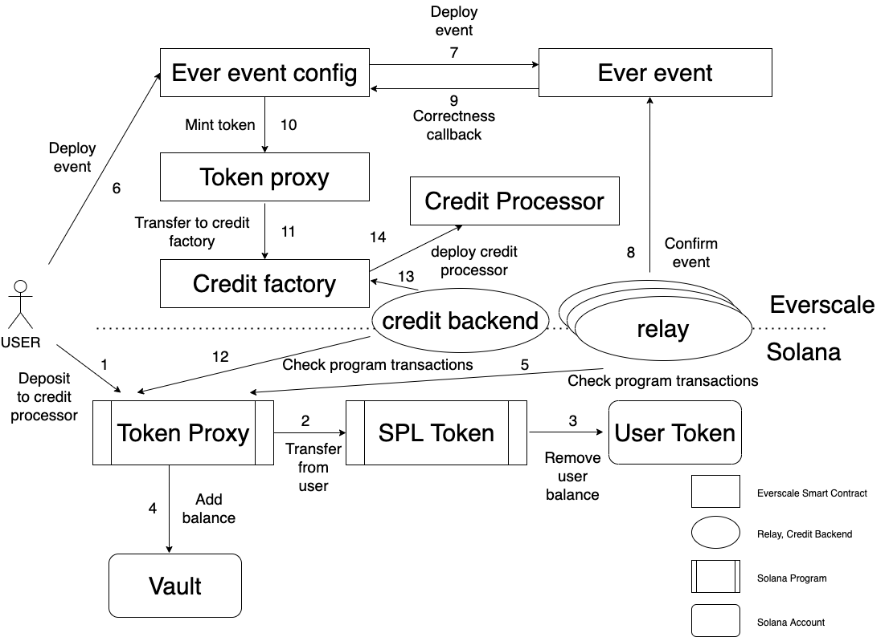

# Proposal #1

## Motivation

Bridge `Solana-Everscale` will have the ability to transfer `Solana` tokens from `Solana` to `Everscale` for users that do not have `Evers`. 
The idea here is to use credit factory and credit processors in `Everscale` blockchain to swap part of `Solana` tokens to `Evers`
to deploy users token smart contract. Additional credit backend must be used to transfer specific payload from `Solana` to `Everscale`.

## Algorithm

1. `Solana` `Token proxy` program receives withdraw request from user via Web3.
2. It uses `SPL token` program to transfer tokens from user to vault.
3. `SPL token` program decreases users balance.
4. `SPL token` program increases vault balance.
5. Relays monitor `Solana` `Token proxy` program transactions to receive notification about new transfers via `Solana` Node RPC.
6. User deploys event of new transfer to `Everscale event configuration` via Web3.
7. `Everscale event configuration` deploys new `Everscale event` with payload containing transfer.
8. Relays confirm `Everscale event`.
9. `Everscale event` sends correctness callback to `Everscale event configuration`.
10. `Everscale event configuration` mints `Solana` tokens via `Token proxy` 
11. `Token proxy` sends them to `Credit factory` address in `Everscale` blockchain.
12. Credit backend monitor `Solana` `Token proxy` program transactions. 
13. Credit backend parses specific payload and calls deploy of credit processor.
14. `Credit factory` deploys `Credit processor` for specified request.

## Scheme

## Proposal #2

To save all token burns by user it is good to use the same PDA as for `Solana` tokens from `Solana` to `Everscale` transfer,
created on each user request.
Between steps 4 and 5 `Token proxy` program should create such one.

### Deposit model

Deposit model is the same as for `Solana` tokens from `Solana` to `Everscale` transfer.

## Proposal #3

`Token proxy` program can execute some payload beside withdrawing tokens to `Solana` or `Everscale`. This can help to 
connect other protocols to the bridge.

### Withdrawal model

For these purposes additional field `payload` will be presented in withdrawal event and `ExecutePayload` instructions
in the program. Relays can call it in automatic mode after approving the event. 
The only issue here is that program can control only its PDA, so tokens must be transferred to some proxy account 
owned by `Token proxy`, and then instructions from payload can be executed over it.

### Deposit model
Some payload may also be included in deposit model, to be executed in `Everscale` side after successful transfer.
