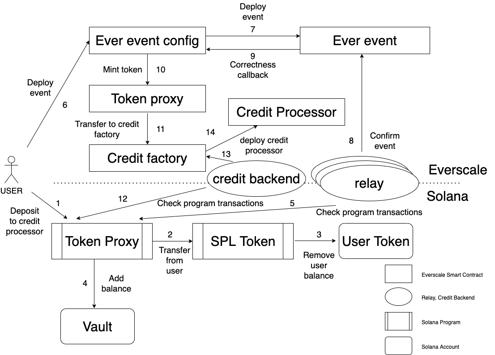

# Principles

Bridge `Solana-Everscale` will have the ability to transfer `Solana` tokens from `Solana` to `Everscale` for users that do not have `Evers`. 
The idea here is to use credit factory and credit processors in `Everscale` blockchain to swap part of `Solana` tokens to `Evers`
to deploy users token smart contract. Additional credit backend must be used to transfer specific payload from `Solana` to `Everscale`.

## Algorithm

1. `Solana` `Token proxy` program receives withdraw request from user via Web3.
2. It uses `SPL token` program to transfer tokens from user to vault.
3. `SPL token` program decreases users balance.
4. `SPL token` program increases vault balance.
5. Relays monitor `Solana` `Token proxy` program transactions to receive notification about new transfers via `Solana` Node RPC.
6. User deploys event of new transfer to `Ever event config` via Web3.
7. `Ever event config` deploys new `Ever event` with payload containing transfer.
8. Relays confirm `Ever event`.
9. `Ever event` sends correctness callback to `Ever event config`.
10. `Ever event config` mints `Solana` tokens via `Token proxy` 
11. `Token proxy` sends them to `Credit factory` address in `Everscale` blockchain.
12. Credit backend monitor `Solana` `Token proxy` program transactions. 
13. Credit backend parses specific payload and calls deploy of credit processor.
14. `Credit factory` deploys `Credit processor` for specified request.

## Reminders

1. Set owner of `Vault` account to `Token proxy` program.

## Schema

