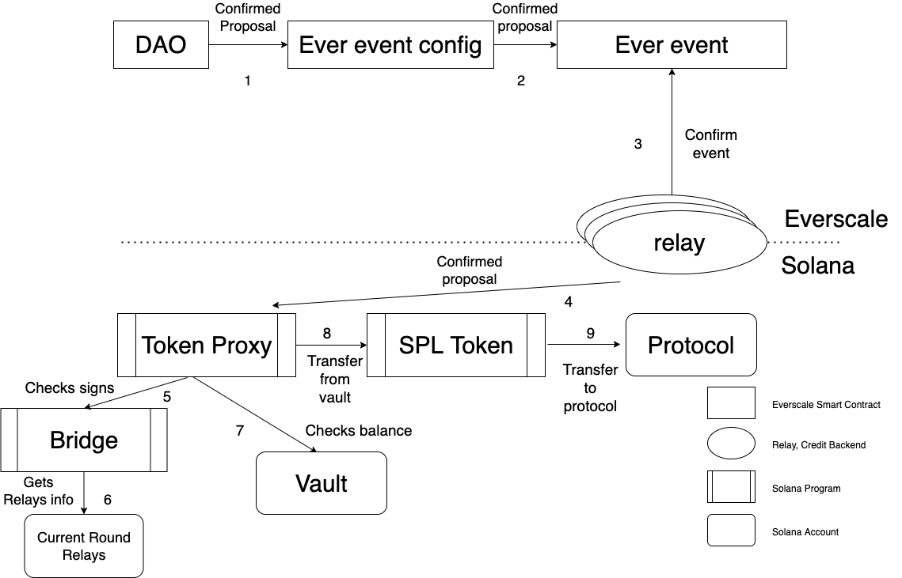

# Proposal #1

## Motivation

To earn money on bridge locked liquidity in `Solana` some of the deposit protocols may be used. When DAO in `Everscale` decides to do so, it makes a proposal.
Voters, who have `Bridge` tokens can vote for it and, when the voting is finished with positive result, one can start process of
transferring liquidity from `Solana` vault to chosen protocol.

## Algorithm

1. `Everscale` `DAO` sends confirmed proposal to `Ever event config`.
2. `Ever event config` deploys new `Ever event` with payload containing proposal executive.
3. Relays confirm this event.
4. Relays transfer this event to `Solana` `Token Proxy` program.
5. `Token Proxy` program calls check signs in `Bridge` program.
6. `Bridge` program gets current round relays info (public keys, addresses) from PDA and checks correctness of signatures received in event info.
7. If no error got from `Bridge` program, then `Token proxy` checks balance on `Vault` account.
8. `Token proxy` program calls transfer tokens on `SPL token` program.
9. `SPL token` program decreases `Vault` account tokens and increases protocol tokens balance.

## Questions

1. Where to store current round account address?
It will be passed on program input by user, and it must be validated in `Bridge` program.
2. Who transfers new round relays to `Solana`?
If it is relays, they must have lamports to pay gas fee. 
If it is some kind of admin, it must have access to do it. Maybe he mustn't as this event is signed by old round relays and this check is enough.

## Scheme

